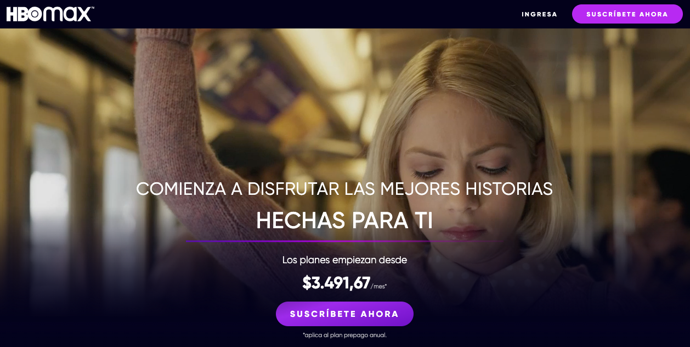
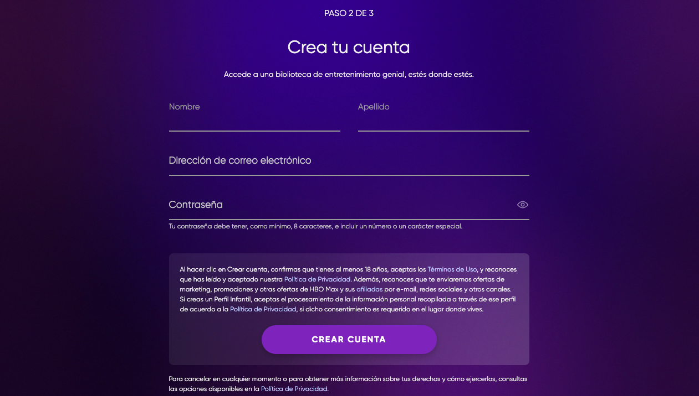
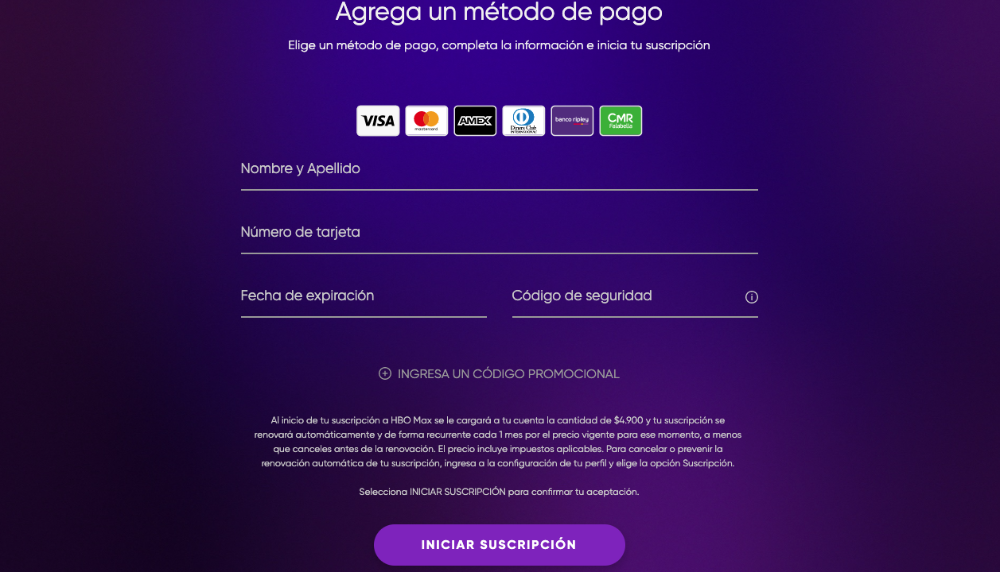
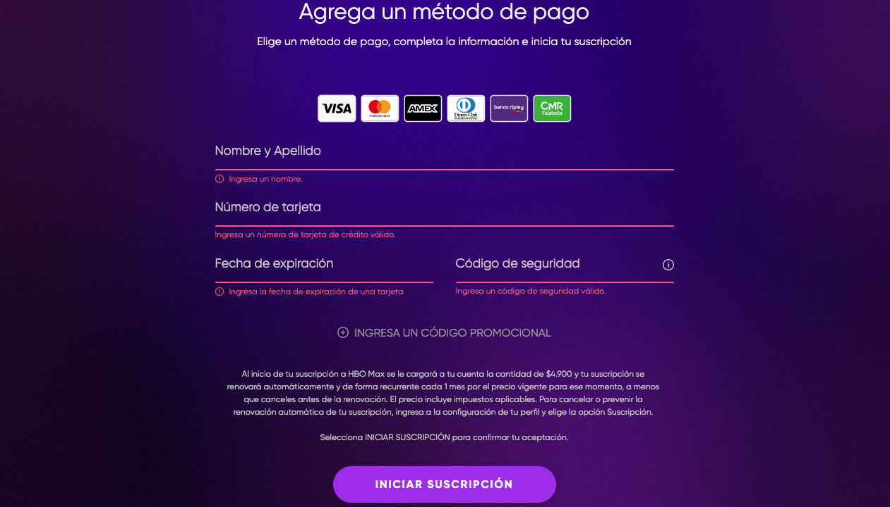
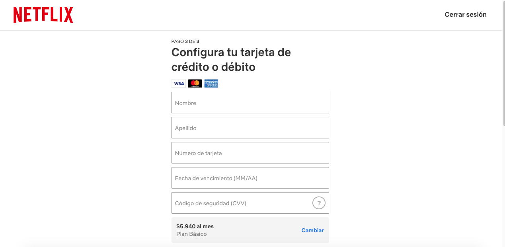
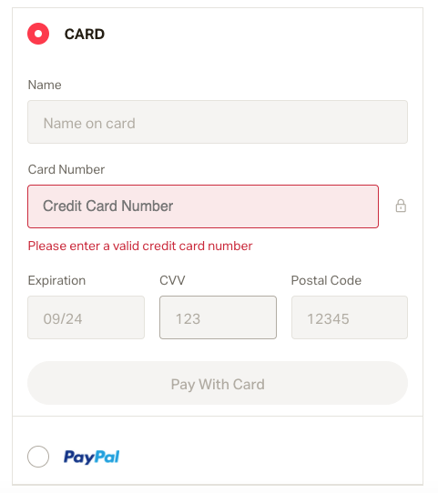

# Tarjeta de crédito válida

## Índice

* [1. Experiencia de Usuario](#1-experiencia-de-usuario)
* [2. Resumen del proyecto](#2-interfaz-de-usuario)
  * [2.1 Referencias](#2.1-referencias)
  * [2.2 Prototipo de baja fidelidad](#2.2-prototipo-de-baja-fidelidad)
  * [2.3 Prototipo de alta fidelidad](#2.3-prototipo-de-alta-fidelidad)
* [3. Prototipo final](#3-prototipo-final)

***

## 1. Experiencia de Usuario

Este proyecto está pensado para los usuarios puedan acceder a material inédito de sus artistas o creadores de contenido favoritos, pudiendo acceder a su proceso creativo o actividades junto al creador. De paso se generará una red de micro mecenas que podrán entregar una entrada de dinero a los artistas para que así puedan seguir creando.

## 2. Interfaz de Usuario

La interfaz se enfocó en que fuese una plataforma directa y rápida al momento en que el usuario accede a la plataforma y este pueda suscribirse. Se escogió una paleta de 4 colores para dar carácter y que esta sea reconocible.

### 2.1 Referencias

### 2.2 Prototipo de baja fidelidad
### 2.3 Prototipo de alta fidelidad

## 3.Prototipo Final

