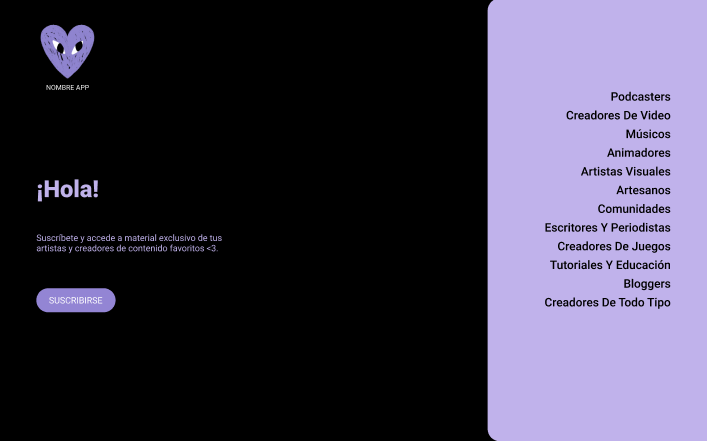
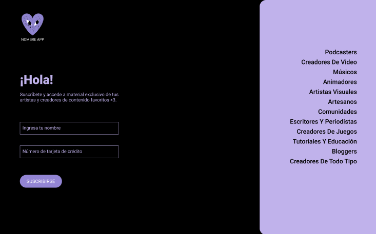

# Tarjeta de crédito válida

## Índice

* [1. Experiencia de Usuario](#1-experiencia-de-usuario)
* [2. Resumen del proyecto](#2-interfaz-de-usuario)
  * [2.1 Referencias](#2.1-referencias)
  * [2.2 Prototipo de baja fidelidad](#2.2-prototipo-de-baja-fidelidad)
  * [2.3 Prototipo de alta fidelidad](#2.3-prototipo-de-alta-fidelidad)
* [3. Prototipo final](#3-prototipo-final)

***

## 1. Experiencia de Usuario

Este proyecto está pensado para los usuarios puedan acceder a material inédito de sus artistas o creadores de contenido favoritos, pudiendo acceder a su proceso creativo o actividades junto al creador. De paso se generará una red de micro mecenas que podrán entregar una entrada de dinero a los artistas para que así puedan seguir creando.
Se quizo hacer referencia a la plataforma Patreon.

## 2. Interfaz de Usuario

La interfaz se enfocó en que fuese una plataforma directa y rápida al momento en que el usuario accede a la plataforma y este pueda suscribirse. El sitio estará compuesto por un logo, un texto de bienvenida, un formulario, un botón para suscribirse y una lista de tipos de contenido que se podrán encontrar en la página. 
Se escogió una paleta de 4 colores para dar carácter y que esta sea reconocible, además de una tipografía sans seriff para facilitar la lectura.

### 2.1 Referencias

Para el diseño de interfaz se toman de referencia la disposición de los elementos de distintas plataformas que requieren suscripción, como HBO Max, Netflix y Patreon.

### 2.2 Prototipo de baja fidelidad

### 2.3 Prototipo de alta fidelidad

#### Primer prototipo

Se lleva a cabo el primer prototipo de alta fidelidad considerando una dos cambios de página para nuestra plataforma, primero la de inicio y luego la del formulario. Se define la forma en que se mostrarán los datos inváidos y váidos.

### Segundo Prototipo

Se reajusta el diseño considerando el tiempo para la implementación de la página, por lo que se decide unir la página de inicio con la del formulario y así poder implentar la funcionalidad del algoritmo para la validación de la tarjeta.

## 3.Prototipo Final

Para visitar la página pinche [aquí](src/index.html) y probarla con este número de tarjeta válido 4552664041090033.

